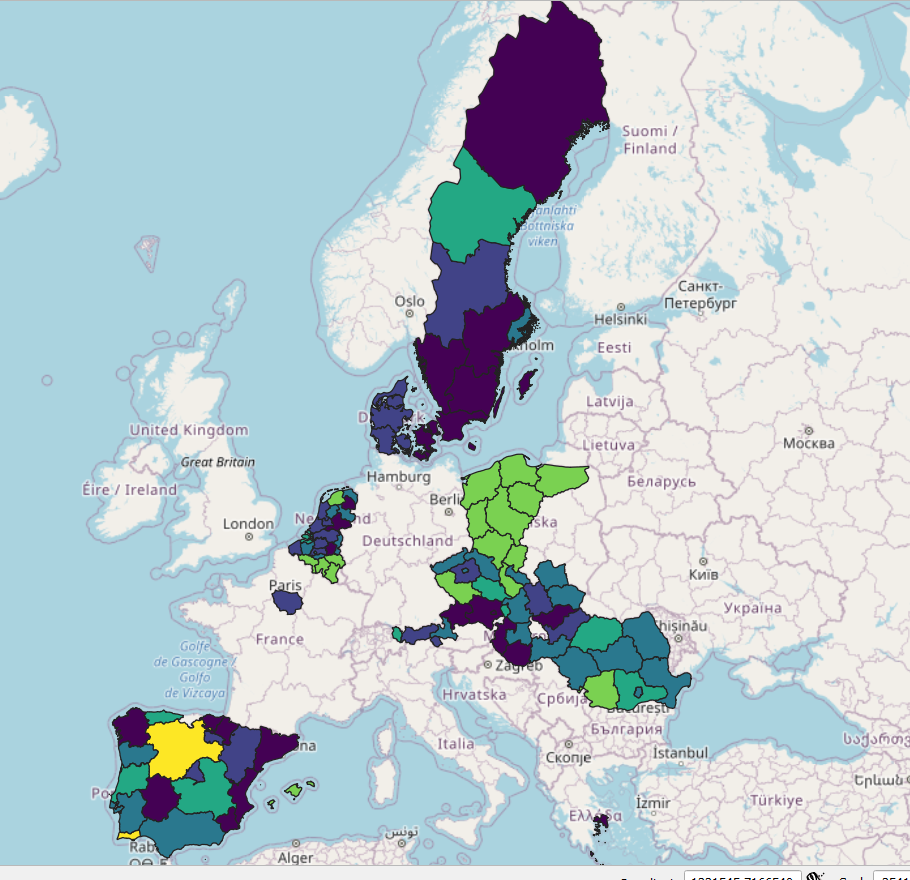

Retrospective survey harmonization comes with many challenges, as we
have shown in the
[introduction](/post/2021-03-04_retroharmonize_intro/)
to this tutorial case study. In this example, we will work with
Eurobarometer’s data.

{}
This code tutorial is not outdated, but the [retroharmonize](https://retroharmonize.dataobservatory.eu/) R package has a new (development) release with more featues.
{}





Please use the development version of
[retroharmonize](https://retroharmonize.dataobservatory.eu/):

    devtools::install_github("antaldaniel/retroharmonize")

    library(retroharmonize)
    library(dplyr)       # this is necessary for the example 
    library(lubridate)   # easier date conversion

    ## Warning: package 'lubridate' was built under R version 4.0.4

    library(stringr)     # You can also use base R string processing functions 

## Get the Data

`retroharmonize` is not associated with Eurobarometer, or its creators,
Kantar, or its archivists, GESIS. We assume that you have acquired the
necessary files from GESIS after carefully reading their terms and you
placed it on a path that you call gesis\_dir. The precise documentation
of the data we use can be found in this supporting
[blogpost](http://netzero.dataobservatory.eu/post/2021-03-04-eurobarometer_data/).
To reproduce this blogpost, you will need `ZA5877_v2-0-0.sav`,
`ZA6595_v3-0-0.sav`, `ZA6861_v1-2-0.sav`, `ZA7488_v1-0-0.sav`,
`ZA7572_v1-0-0.sav` in a directory that you will name `gesis_dir`.

    #Not run in the blogpost. In the repo we have a saved version.
    climate_change_files <- c("ZA5877_v2-0-0.sav", "ZA6595_v3-0-0.sav",  "ZA6861_v1-2-0.sav", 
                              "ZA7488_v1-0-0.sav", "ZA7572_v1-0-0.sav")

    eb_waves <- read_surveys(file.path(gesis_dir, climate_change_files), .f='read_spss')

    if (dir.exists("data-raw")) {
      save ( eb_waves,  file:  file.path("data-raw", "eb_climate_change_waves.rda") )
    }

    if ( file.exists( file.path("data-raw", "eb_climate_change_waves.rda") )) {
      load (file.path( "data-raw", "eb_climate_change_waves.rda" ) )
    } else {
      load (file.path("..", "..",  "data-raw", "eb_climate_change_waves.rda") )
    }

The `eb_waves` nested list contains five surveys imported from SPSS to
the survey class of
[retroharmonize](https://retroharmonize.dataobservatory.eu/articles/labelled_spss_survey.html).
The survey class is a data.frame that retains important metadata for
further harmonization.

    document_waves (eb_waves)

    ## # A tibble: 5 x 5
    ##   id            filename           ncol  nrow object_size
    ##   <chr>         <chr>             <int> <int>       <dbl>
    ## 1 ZA5877_v2-0-0 ZA5877_v2-0-0.sav   604 27919   139352456
    ## 2 ZA6595_v3-0-0 ZA6595_v3-0-0.sav   519 27718   119370440
    ## 3 ZA6861_v1-2-0 ZA6861_v1-2-0.sav   657 27901   151397528
    ## 4 ZA7488_v1-0-0 ZA7488_v1-0-0.sav   752 27339   169465928
    ## 5 ZA7572_v1-0-0 ZA7572_v1-0-0.sav   348 27655    80562432

Beware the object sizes. If you work with many surveys, memory-efficient
programming becomes imperative. We will be subsetting whenever possible.

## Metadata analysis

As noted before, prepare to work with nested lists. Each imported survey
is nested as a data frame in the `eb_waves` list.

## Metadata: Protocol Variables

Eurobarometer calls certain metadata elements, like interviewee
cooperation level or the date of a survey interview as protocol
variable. Let’s start here. This will be our template to harmonize more
and more aspects of the five surveys (which are, in fact, already
harmonization of about 30 surveys conducted in a single ‘wave’ in
multiple countries.)

    # select variables of interest from the metadata
    eb_protocol_metadata <- eb_climate_metadata %>%
      filter ( .data$label_orig %in% c("date of interview") |
                 .data$var_name_orig: = "rowid")  %>%
      suggest_var_names( survey_program:  "eurobarometer" )

    # subset and harmonize these variables in all nested list items of 'waves' of surveys
    interview_dates <- harmonize_var_names(eb_waves, 
                                           eb_protocol_metadata )

    # apply similar data processing rules to same variables
    interview_dates <- lapply (interview_dates, 
                          function (x) x %>% mutate ( date_of_interview:  as_character(.data$date_of_interview) )
                          )

    # join the individual survey tables into a single table 
    interview_dates <- as_tibble ( Reduce (rbind, interview_dates) )

    # Check the variable classes.

    vapply(interview_dates, function(x) class(x)[1], character(1))

    ##             rowid date_of_interview 
    ##       "character"       "character"

This is our sample workflow for each block of variables.

1.  Get a unique identifier.
2.  Add other variables
3.  Harmonize the variable names
4.  Subset the data leaving out anything that you do not harmonize in
    this block.  
5.  Apply some normalization in a nested list.
6.  When the variables are harmonized to same name, class, merge them
    into a data.frame-like `tibble` object.

Now finish the harmonization. `Wednesday, 31st October 2018` should
become a Date type `2018-10-31`.

    require(lubridate)
    harmonize_date <- function(x) {
      x <- tolower(as.character(x))
      x <- gsub("monday|tuesday|wednesday|thursday|friday|saturday|sunday|\\,|th|nd|rd|st", "", x)
      x <- gsub("decemberber", "december", x) # all those annoying real-life data problems!
      x <- stringr::str_trim (x, "both")
      x <- gsub("^0", "", x )
      x <- gsub("\\s\\s", "\\s", x)
      lubridate::dmy(x) 
    }

    interview_dates <- interview_dates %>%
      mutate ( date_of_interview:  harmonize_date(.data$date_of_interview) )

    vapply(interview_dates, function(x) class(x)[1], character(1))

    ##             rowid date_of_interview 
    ##       "character"            "Date"

To avoid duplication of row IDs in surveys that may not be unique in
*different* surveys, we created a simple, sequential ID for each survey,
including the ID of the original file.

    set.seed(2021)
    sample_n(interview_dates, 6)

    ## # A tibble: 6 x 2
    ##   rowid               date_of_interview
    ##   <chr>               <date>           
    ## 1 ZA7488_v1-0-0_7016  2018-10-28       
    ## 2 ZA7488_v1-0-0_19187 2018-11-02       
    ## 3 ZA6861_v1-2-0_1218  2017-03-18       
    ## 4 ZA6861_v1-2-0_4142  2017-03-21       
    ## 5 ZA7572_v1-0-0_12363 2019-04-17       
    ## 6 ZA7572_v1-0-0_8071  2019-04-18

After this type-conversion problem let’s see an issue when an original
SPSS variable can have two meaningful R representations.

## Metadata: Geographical information

Let’s continue with harmonizing geographical information in the files.
In this example, `var_name_suggested` will contain the harmonized
variable name. It is likely that you have to make this call, after
carefully reading the original questionnaires and codebooks.

    eb_regional_metadata <- eb_climate_metadata %>%
      filter ( grepl( "rowid|isocntry|^nuts$", .data$var_name_orig)) %>%
      suggest_var_names( survey_program:  "eurobarometer" ) %>%
      mutate ( var_name_suggested:  case_when ( 
        var_name_suggested: = "region_nuts_codes"     ~ "geo",
        TRUE ~ var_name_suggested ))

The `harmonize_var_names()` takes all variables in the subsetted,
geographical metadata table, and brings them to the harmonized
`var_name_suggested` name. The function subsets the surveys to avoid the
presence of non-harmonized variables. All regional NUTS codes become
`geo` in our case:

    geography <- harmonize_var_names(eb_waves, 
                                     eb_regional_metadata)

If you are used to work with single survey files, you are likely to work
in a tabular format, which easily converts into a data.frame like
object, in our example, to tidyverse’s `tibble`. However, when working
with longitudinal data, it is far simpler to work with nested lists,
because the tables usually have different dimensions (neither the rows
corresponding to observations or the columns are the same across all
survey files.)

In the nested list, each list element is a single, tabular-format
survey. (In fact, the survey are in retroharmonize’s
[survey](https://retroharmonize.dataobservatory.eu/reference/survey.html)
class, which is a rich tibble that contains the metadata and the
processing history of the survey.)

The regional information in the Eurobarometer files is contained in the
`nuts` variable. We want to keep both the original labels and values.
The original values are the region’s codes, and the labels are the
names. The easiest and fastest solution is the base R `lapply` loop.

    geography <- lapply ( geography, 
                          function (x) x %>% mutate ( region:  as_character(geo), 
                                                      geo   :  as.character(geo) )  
    )

Because each table has exactly the same columns, we can simply use
`rbind()` and reduce the list to a modern `data.frame`, i.e. a `tibble`.

    geography <- as_tibble ( Reduce (rbind, geography) )

Let’s see a dozen cases:

    set.seed(2021)
    sample_n(geography, 12)

    ## # A tibble: 12 x 4
    ##    rowid               isocntry geo   region              
    ##    <chr>               <chr>    <chr> <chr>               
    ##  1 ZA7488_v1-0-0_7016  SI       SI012 Podravska           
    ##  2 ZA7488_v1-0-0_19187 PL       PL63  Pomorskie           
    ##  3 ZA6861_v1-2-0_1218  DK       DK02  Sjaelland           
    ##  4 ZA6861_v1-2-0_4142  FI       FI1B  Helsinki-Uusimaa    
    ##  5 ZA7572_v1-0-0_12363 SE       SE12  Oestra Mellansverige
    ##  6 ZA7572_v1-0-0_8071  IT       ITH   Nord-Est [IT]       
    ##  7 ZA6861_v1-2-0_6145  IE       IE021 Dublin              
    ##  8 ZA6861_v1-2-0_24638 RO       RO31  South [RO]          
    ##  9 ZA7488_v1-0-0_11315 CY       CY    REPUBLIC OF CYPRUS  
    ## 10 ZA6595_v3-0-0_27568 HR       HR041 Grad Zagreb         
    ## 11 ZA7572_v1-0-0_17397 CZ       CZ06  Jihovychod          
    ## 12 ZA6861_v1-2-0_10993 PT       PT17  Lisboa

The idea is that we do similar variable harmonization block by block,
and eventually we will join them together. Next step: socio-demography
and weights.

## Socio-demography and Weights

There are a few peculiar issues to look out for. This example shows that
survey harmonization requires plenty of expert judgment, and you cannot
fully automate the process.

The Eurobarometer archives do not use all weight and demographic
variable names consistently. For example, the `wex` variable, which is a
projected weight for the country’s 15 years old or older population is
sometimes called `wex`, sometimes `wextra`. The individual survey’s
post-stratification weight is the `w1` variable, but this is not
necessarily what you need to use.

The `suggest_var_names()` function has a parameter for
`survey_program:  "eurobaromater"` which normalizes a bit the most used
variables. For example, all variations of wex, wextra wil be noramlized
to wex. You can ignore this parameter and use your own names, too.

    eb_demography_metadata  <- eb_climate_metadata %>%
      filter ( grepl( "rowid|isocntry|^d8$|^d7$|^wex|^w1$|d25|^d15a|^d11$", .data$var_name_orig) ) %>%
      suggest_var_names( survey_program:  "eurobarometer")

As you can see, using the original labels would not help, because they
also contain various alterations.

    eb_demography_metadata %>%
      select ( filename, var_name_orig, label_orig, var_name_suggested ) %>%
      filter (var_name_orig %in% c("wex", "wextra") )

    ##            filename var_name_orig                                  label_orig
    ## 1 ZA5877_v2-0-0.sav        wextra      weight extrapolated population 15 plus
    ## 2 ZA6595_v3-0-0.sav        wextra      weight extrapolated population 15 plus
    ## 3 ZA6861_v1-2-0.sav           wex weight extrapolated population aged 15 plus
    ## 4 ZA7488_v1-0-0.sav           wex weight extrapolated population aged 15 plus
    ## 5 ZA7572_v1-0-0.sav           wex weight extrapolated population aged 15 plus
    ##   var_name_suggested
    ## 1                wex
    ## 2                wex
    ## 3                wex
    ## 4                wex
    ## 5                wex

    demography <- harmonize_var_names ( waves:  eb_waves, 
                                        metadata:  eb_demography_metadata ) 

Socio-demographic variables like level of highest education or
occupation are rather country-specific. Eurobarometer uses standardized
occupation and marital status scales, and a proxy for education levels,
age of leaving full-time education.

This is a particularly tricky variable, because it’s coding in fact
contains three different variables - school leaving age, except for
students, and except for people who did not finish their compulsory
primary school. And while school leaving age was a good proxy since the
1970s, in the age when the EU is promoting life-long-learning becomes
less and less useful, as people stop and re-start their education
throughout their lives.

    example <- demography[[1]] %>%
      mutate ( across ( -any_of(c("rowid", "w1", "wex")), as_character) ) %>%
      mutate ( across (any_of(c("w1", "wex")), as_numeric) )
    unique ( example$age_education )

    ##  [1] "22"                     "25"                     "17"                    
    ##  [4] "19"                     "12"                     "23"                    
    ##  [7] "18"                     "20"                     "21"                    
    ## [10] "14"                     "24"                     "16"                    
    ## [13] "26"                     "15"                     "Still studying"        
    ## [16] "DK"                     "31"                     "29"                    
    ## [19] "27"                     "13"                     "32"                    
    ## [22] "28"                     "30"                     "53"                    
    ## [25] "42"                     "62"                     "40"                    
    ## [28] "No full-time education" "Refusal"                "37"                    
    ## [31] "39"                     "34"                     "35"                    
    ## [34] "47"                     "36"                     "45"                    
    ## [37] "51"                     "33"                     "43"                    
    ## [40] "38"                     "49"                     "46"                    
    ## [43] "41"                     "57"                     "7"                     
    ## [46] "48"                     "44"                     "50"                    
    ## [49] "56"                     "8"                      "11"                    
    ## [52] "10"                     "9"                      "75 years"              
    ## [55] "6"                      "3"                      "54"                    
    ## [58] "55"                     "60"                     "64"                    
    ## [61] "2 years"                "58"                     "52"                    
    ## [64] "72"                     "61"                     "4"                     
    ## [67] "63"

The seamingly trival `age_exact` variable has its own issues, too:

    unique ( example$age_exact)

    ##  [1] "54"       "66"       "56"       "53"       "33"       "72"      
    ##  [7] "83"       "62"       "86"       "77"       "64"       "46"      
    ## [13] "44"       "59"       "60"       "67"       "63"       "20"      
    ## [19] "43"       "37"       "78"       "49"       "90"       "45"      
    ## [25] "28"       "29"       "30"       "39"       "51"       "38"      
    ## [31] "41"       "71"       "25"       "48"       "79"       "88"      
    ## [37] "61"       "85"       "70"       "35"       "81"       "52"      
    ## [43] "57"       "27"       "47"       "15 years" "21"       "42"      
    ## [49] "32"       "68"       "36"       "34"       "19"       "31"      
    ## [55] "26"       "23"       "24"       "22"       "16"       "84"      
    ## [61] "65"       "18"       "55"       "40"       "50"       "73"      
    ## [67] "69"       "87"       "89"       "74"       "75"       "98 years"
    ## [73] "76"       "80"       "58"       "82"       "17"       "93"      
    ## [79] "91"       "92"       "95"       "94"       "97"

Let’s see all the strange labels attached to `age`-type variables:

    collect_val_labels(metadata:  eb_demography_metadata %>%
                         filter ( var_name_suggested %in% c("age_exact", "age_education")) )

    ##  [1] "2 years"                  "75 years"                
    ##  [3] "No full-time education"   "Still studying"          
    ##  [5] "15 years"                 "98 years"                
    ##  [7] "96 years"                 "[NOT CLEARLY DOCUMENTED]"
    ##  [9] "74 years"                 "99 and older"            
    ## [11] "Refusal"                  "87 years"                
    ## [13] "DK"                       "88 years"

We must handle many exception, so we created a function for this
purpose:

    remove_years  <- function(x) { 
      x <- gsub("years|and\\solder", "", tolower(x))
      stringr::str_trim (x, "both")}

    process_demography <- function (x) { 
      
      x %>% mutate ( across ( -any_of(c("rowid", "w1", "wex")), as_character) ) %>%
        mutate ( across (any_of(c("w1", "wex")), as_numeric) ) %>%
        mutate ( across (contains("age"), remove_years)) %>%
        mutate ( age_exact:  as.numeric (age_exact)) %>%
        mutate ( is_student:  ifelse ( tolower(age_education): = "still studying", 
                                       1, 0), 
                 no_education:  ifelse ( tolower(age_education): = "no full-time education", 1, 0)) %>%
        mutate ( education:  case_when (
          grepl("studying", age_education) ~ age_exact, 
          grepl ("education", age_education)  ~ 14, 
          grepl ("refus|document|dk", tolower(age_education)) ~ NA_real_,
          TRUE ~ as.numeric(age_education)
        ))  %>%
        mutate ( education:  case_when ( 
          education < 14 ~ NA_real_, 
          education > 30 ~ 30, 
          TRUE ~ education )) 
    }

    demography <- lapply ( demography, process_demography )

    ## Warning in eval_tidy(pair$rhs, env:  default_env): NAs introduced by coercion

    ## Warning in mask$eval_all_mutate(quo): NAs introduced by coercion

    ## Warning in eval_tidy(pair$rhs, env:  default_env): NAs introduced by coercion

    ## Warning in eval_tidy(pair$rhs, env:  default_env): NAs introduced by coercion

    ## Warning in eval_tidy(pair$rhs, env:  default_env): NAs introduced by coercion

    ## Warning in eval_tidy(pair$rhs, env:  default_env): NAs introduced by coercion

    ## WE'll full join and not use rbind, because we have different variables in different waves.
    demography <- Reduce ( full_join, demography )

    ## Joining, by:  c("rowid", "isocntry", "w1", "wex", "marital_status", "age_education", "age_exact", "occupation_of_respondent", "occupation_of_respondent_recoded", "respondent_occupation_scale_c_14", "type_of_community", "is_student", "no_education", "education")
    ## Joining, by:  c("rowid", "isocntry", "w1", "wex", "marital_status", "age_education", "age_exact", "occupation_of_respondent", "occupation_of_respondent_recoded", "respondent_occupation_scale_c_14", "type_of_community", "is_student", "no_education", "education")
    ## Joining, by:  c("rowid", "isocntry", "w1", "wex", "marital_status", "age_education", "age_exact", "occupation_of_respondent", "occupation_of_respondent_recoded", "respondent_occupation_scale_c_14", "type_of_community", "is_student", "no_education", "education")
    ## Joining, by:  c("rowid", "isocntry", "w1", "wex", "marital_status", "age_education", "age_exact", "occupation_of_respondent", "occupation_of_respondent_recoded", "respondent_occupation_scale_c_14", "type_of_community", "is_student", "no_education", "education")

Now let’s see what we have here:

    set.seed(2021)
    sample_n(demography, 12)

    ## # A tibble: 12 x 14
    ##    rowid    isocntry    w1    wex marital_status        age_education  age_exact
    ##    <chr>    <chr>    <dbl>  <dbl> <chr>                 <chr>              <dbl>
    ##  1 ZA7488_~ SI       0.828  1428. (Re-)Married: withou~ 19                    43
    ##  2 ZA7488_~ PL       1.01  32830. (Re-)Married: withou~ 19                    64
    ##  3 ZA6861_~ DK       0.641  3100. (Re-)Married: withou~ 22                    78
    ##  4 ZA6861_~ FI       1.83   8601. (Re-)Married: childr~ 30                    38
    ##  5 ZA7572_~ SE       0.342  2645. (Re-)Married: withou~ 17                    68
    ##  6 ZA7572_~ IT       0.630 32287. (Re-)Married: childr~ 20                    40
    ##  7 ZA6861_~ IE       0.868  3054. (Re-)Married: childr~ 32                    42
    ##  8 ZA6861_~ RO       0.724 11805. (Re-)Married: withou~ 14                    59
    ##  9 ZA7488_~ CY       0.691  1013. (Re-)Married: childr~ 18                    67
    ## 10 ZA6595_~ HR       0.580  2098. Single living w part~ 27                    30
    ## 11 ZA7572_~ CZ       1.86  16908. Single: without chil~ still studying        20
    ## 12 ZA6861_~ PT       0.932  7448. Widow: with children  no full-time ~        84
    ## # ... with 7 more variables: occupation_of_respondent <chr>,
    ## #   occupation_of_respondent_recoded <chr>,
    ## #   respondent_occupation_scale_c_14 <chr>, type_of_community <chr>,
    ## #   is_student <dbl>, no_education <dbl>, education <dbl>

## Harmonizing Variable Labels

So far we have been working with metadata, weights and socio-demography.
In other words, we have not even started the desired harmonization of
climate change awareness. The methodology is the same, but here we
really must look out for the answer options in the questionnaire. (Refer
to our data summary again
[here](http://netzero.dataobservatory.eu/post/2021-03-04-eurobarometer_data/).)

    climate_awareness_metadata <- eb_climate_metadata %>%
      suggest_var_names( survey_program:  "eurobarometer" ) %>%
      filter ( .data$var_name_suggested  %in% c("rowid",
                                                "serious_world_problems_first", 
                                                 "serious_world_problems_climate_change")
      ) 

    hw <- harmonize_var_names ( waves:  eb_waves, 
                                metadata:  climate_awareness_metadata )

The `retroharmoinze` package comes with a generic
[harmonize\_values()](https://retroharmonize.dataobservatory.eu/reference/harmonize_waves.html)
function that will change the value labels of categorical variables
(including binary ones) to a unitary format. It will also take care of
various types of missing values.

First, let’s go back to our metadata and collect all value labels that
will show up with
[collect\_val\_labels()](https://retroharmonize.dataobservatory.eu/reference/collect_val_labels.html):

    collect_val_labels(climate_awareness_metadata)

    ##  [1] "Climate change"                            
    ##  [2] "International terrorism"                   
    ##  [3] "Poverty, hunger and lack of drinking water"
    ##  [4] "Spread of infectious diseases"             
    ##  [5] "The economic situation"                    
    ##  [6] "Proliferation of nuclear weapons"          
    ##  [7] "Armed conflicts"                           
    ##  [8] "The increasing global population"          
    ##  [9] "Other (SPONTANEOUS)"                       
    ## [10] "None (SPONTANEOUS)"                        
    ## [11] "Not mentioned"                             
    ## [12] "Mentioned"                                 
    ## [13] "DK"

In this case, we want to select `Climate change` as the mentioned *most
serious problem*, and `Climate change` taken from a list of three
serious problems. The first question type is a single-choice one, where
`Climate change` is either mentioned, or the alternative answer is
labeled as `Not mentioned`. In the multiple choice case, the alternative
may be something else, for example, `Spread of infectious diseases`, as
we all well know by 2021.

We want to see who thought `Climate change` was the most serious
problem, or one of the most serious problems, so we label each mentions
of `Climate change` as `mentioned` and we pair it with a numeric value
of `1`. All other cases are labeled as `not_mentioned`, with the
exceptions of various missing observations, which in these cases are
`Do not know` answers, `Declined to answer` cases, and `Inappropriate`
cases \[The latter one is Eurobarometer’s label for questions that were
for one reason or other not asked from a particular interviewee – for
example, because the Turkish Cypriot community received a different
questionnaire.\]

    # positive cases
    label_1:  c("^Climate\\schange", "^Mentioned")
    # missing cases 
    na_labels <- collect_na_labels( climate_awareness_metadata)
    na_labels

    ## [1] "DK"                             "Inap. (10 or 11 in qa1a)"      
    ## [3] "Inap. (coded 10 or 11 in qc1a)" "Inap. (coded 10 or 11 in qb1a)"

    # negative cases
    label_0 <- collect_val_labels( climate_awareness_metadata)
    label_0 <- label_0[! label_0 %in% label_1 ]

The `harmonize_serious_problems()` function harmonizes the labels within
the special labeled class of `retroharmonize`. This class retains all
information to give categorical variables a character or numeric
representation, and various processing metadata for documentation
purposes. While this class is very reach (it contains whatever was
imported from SPSS’s proprietary data format and the history), it is not
suitable for statistical analysis. We could, of course, directly call
the
[harmonize\_values()](https://retroharmonize.dataobservatory.eu/reference/harmonize_values.html)
from the retroharmonize package, but the parameterization would be very
complicated even in a simple function call, not to mention a looped
call. Because this function is the heart of the
`retroharmonize package`, it has [a tutorial
article](https://retroharmonize.dataobservatory.eu/articles/harmonize_labels.html)
on its own.

    harmonize_serious_problems <- function(x) {
      label_list <- list(
        from:  c(label_0, label_1, na_labels), 
        to:  c( rep ( "not_mentioned", length(label_0) ),   # use the same order as in from!
                rep ( "mentioned", length(label_1) ),
                "do_not_know", "inap", "inap", "inap"), 
        numeric_values:  c(rep ( 0, length(label_0) ), # use the same order as in from!
                           rep ( 1, length(label_1) ),
                           99997,99999,99999,99999)
      )
      
      harmonize_values(x, 
                       harmonize_labels:  label_list, 
                       na_values:  c("do_not_know"=99997,
                                     "declined"=99998,
                                     "inap"=99999), 
                       remove:  "\\(|\\)|\\[|\\]|\\%"
      )
    }

Our objects are rather big in memory, so first, let’s remove the surveys
that do not contain these world problem variables. In this cases, the
subsetted and harmonized surveys in the nested list have only one
columns, i.e. the `rowid`.

    hw <- hw[unlist ( lapply ( hw, ncol)) > 1 ]

Now we have a smaller problem to deal with. With many surveys, it is
easy to fill up your computer’s memory, so let’s start building up our
joined panel data from a smaller set of nested, subsetted surveys.

    hw <- lapply ( hw, function (x) x %>% mutate ( across ( contains("problem"), harmonize_serious_problems) ) )

Our `lapply` loop calls an anonymous function which in turn calls the
`harmonize_serious_problems` parameterized version of the
[harmonize\_values()](https://retroharmonize.dataobservatory.eu/reference/harmonize_values.html)
on all variables that have `problem` in their names.

once we are done, our variables have harmonized names, and harmonized
values, and harmonized label, but they are stored in the complex
[retroharmonize\_labelled\_spss\_survey](https://retroharmonize.dataobservatory.eu/articles/harmonize_labels.html)
class, inherited from the `haven_labelled_spss` in
[haven](https://haven.tidyverse.org/).

We reduced our single and multiple choice questions to binary choice
variables. We can now give them a numeric representation. Be mindful
that `retroharmonize` has special methods for its special labeled class
that retains metadata from SPSS. This means that `as_character` and
`as_numeric` knows how to handle various types of missing values,
whereas the base R `as.character` and `as.numeric` may coerce special
values to unwanted results. This is particularly dangerous with numeric
variables – and this is the reason why we introduced a new set of S3
objects and methods in the package.

We will ignore the differences between various forms of missingness,
i.e. the person said that she did not know, or did not want to answer,
or for some reason was not asked in the survey. In a more descriptive,
non-harmonized analysis you would probably want to explore them as
various ‘categories’ and use a character representation.

    hw <- lapply ( hw, function(x) x %>% mutate ( across ( contains("problem"), as_numeric) ))

    hw <- Reduce ( full_join, hw) # we must use joins instead of binds because the number of columns vary.

Let’s see what we have:

    set.seed(2021)
    sample_n (hw, 12)

    ## # A tibble: 12 x 3
    ##    rowid             serious_world_problems_fi~ serious_world_problems_climate_~
    ##    <chr>                                  <dbl>                            <dbl>
    ##  1 ZA6595_v3-0-0_23~                          0                               NA
    ##  2 ZA7572_v1-0-0_70~                          0                                0
    ##  3 ZA6595_v3-0-0_18~                          0                               NA
    ##  4 ZA6861_v1-2-0_27~                          0                                0
    ##  5 ZA6595_v3-0-0_26~                          0                               NA
    ##  6 ZA7572_v1-0-0_19~                          0                                1
    ##  7 ZA5877_v2-0-0_16~                          0                                0
    ##  8 ZA6861_v1-2-0_12~                          0                                0
    ##  9 ZA7572_v1-0-0_17~                          0                                0
    ## 10 ZA5877_v2-0-0_17~                          0                                1
    ## 11 ZA6861_v1-2-0_41~                          0                                0
    ## 12 ZA6861_v1-2-0_61~                          0                                1

## Creating the Longitudional Table

Now we just need to join the partial table by the `rowid` together:

    #start from the smallest (we removed the survey that had no relevant questionnaire item)
    panel <- hw %>%
      left_join ( geography, by:  'rowid' ) 

    panel <- panel %>%
      left_join ( demography, by:  c("rowid", "isocntry") ) 

    panel <- panel %>%
      left_join ( interview_dates, by:  'rowid' )

And let’s see a small sample:

    sample_n(panel, 12)

    ## # A tibble: 12 x 19
    ##    rowid  serious_world_pr~ serious_world_pr~ isocntry geo   region    w1    wex
    ##    <chr>              <dbl>             <dbl> <chr>    <chr> <chr>  <dbl>  <dbl>
    ##  1 ZA686~                 0                 0 ES       ES41  Casti~ 1.21  46787.
    ##  2 ZA686~                 0                 0 RO       RO31  South~ 0.724 11805.
    ##  3 ZA686~                 0                 0 SK       SK02  Zapad~ 0.774  3499.
    ##  4 ZA757~                 0                 1 PT       PT16  Centr~ 1.11   9336.
    ##  5 ZA659~                 1                NA HR       HR041 Grad ~ 0.580  2098.
    ##  6 ZA659~                 1                NA RO       RO21  North~ 1.21  20160.
    ##  7 ZA686~                 0                 0 PT       PT17  Lisboa 0.932  7448.
    ##  8 ZA659~                 0                NA GB-GBN   UKI   London 0.994 50133.
    ##  9 ZA757~                 0                 0 CY       CY    REPUB~ 0.594   874.
    ## 10 ZA686~                 0                 0 LT       LT003 Klaip~ 0.623  1564.
    ## 11 ZA757~                 0                 0 IE       IE013 West ~ 0.490  1651.
    ## 12 ZA659~                 0                NA LT       LT003 Klaip~ 1.16   2917.
    ## # ... with 11 more variables: marital_status <chr>, age_education <chr>,
    ## #   age_exact <dbl>, occupation_of_respondent <chr>,
    ## #   occupation_of_respondent_recoded <chr>,
    ## #   respondent_occupation_scale_c_14 <chr>, type_of_community <chr>,
    ## #   is_student <dbl>, no_education <dbl>, education <dbl>,
    ## #   date_of_interview <date>

    saveRDS ( panel, file.path(tempdir(), "climate_panel.rds"), version:  2)

    # not evaluated
    saveRDS( panel, file:  file.path("data-raw", "climate-panel.rds"), version=2)

## Putting It on a Map

This is not the end of the story. If you put all this on a map, the
results are a bit disappointing.

Why? Because sub-national (provincial, state, county, district, parish)
borders are changing all the time - within the EU and everywhere. The
next step is to harmonize the geographical information. We have another
CRAN released package to help you with. See the next post: [Regional
Climate Change Awareness
Dataset](https://rpubs.com/antaldaniel/regions-OOD21).
