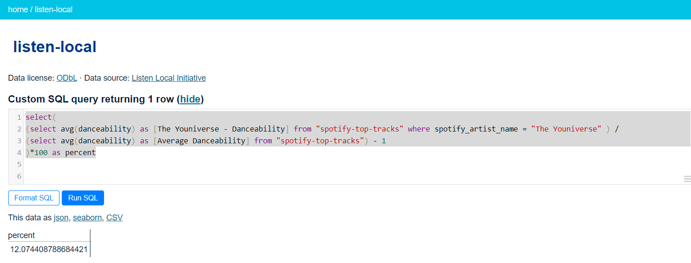

+++
title = "Upgrading the Slovak Music Database: New Data API, New Features"
date = 2021-04-27T19:00:00
lastmod = 2021-04-28T07:10:00
draft = false

authors = ["Daniel Antal"]

project = ["Listen Local"]

tags = ["YouTube", "Slovakia", "mapping", "database"]

summary = "We use the database to monitor market developments in streaming and radio services, and to detect any problems that may lead to a disadvantageous position for Slovak artists.  We are constantly monitoring if Slovak artists, regardless of their age, genre, gender, or ethnicity enjoy equal opportunity on streaming and radio platforms, and we are devising ways to increase their visibility and earnings."

# Featured image
[image]
  # Caption (optional)
  caption = "Find the songs of The Youniverse in the database"

  # Focal point (optional)
  # Options: Smart, Center, TopLeft, Top, TopRight, Left, Right, BottomLeft, Bottom, BottomRight
  focal_point = "Top"

  # Show image only in page previews?
  preview_only = false

+++

We use the database to monitor market developments in streaming and radio services, and to detect any problems that may lead to a disadvantageous position for Slovak artists.  We are constantly monitoring if Slovak artists, regardless of their age, genre, gender, or ethnicity enjoy equal opportunity on streaming and radio platforms, and we are devising ways to increase their visibility and earnings.



The SMDB database has opt-in, opt-out features, and a write-in process, where Slovak musicologists determine if an artist should be written into the database.  The database uses data only from public data sources, and any artists who do not feel Slovak, or do not agree with our approach, can be removed at any time.



Our Demo Music Database was created with the support of the Slovak Arts Council and Consolidated Independent, and in partnership and support with SOZA in 2020.  We are seeking new users and donors to make this database comprehensive and help all artists who feel Slovak to be heard at home and abroad.  With the help of volunteers and Reprex’s own resources, we have added some new features to the database in 2021.

Our database in its early demo form analysed only the Spotify presence of artists.  We have added [YouTube](http://3.221.117.58/listen-local/youtube-librarian) fully to the database, thanks to the work of our new team member, [Botond Vitos, PhD](authors/botond_vitos/. We have also started to integrate his [Bandcamp analyzer tool](https://dataandlyrics.com/post/2021-04-14-bandcamp-librarian-2/) with our [Listen Local App](https://dataobservatory.shinyapps.io/listen-local-app/). Soon we will be able to help on all three platforms.  

We created a modern API to access the database for researchers, labels, and representative music organizations. The API works with standard SQL queries (see full documentation [here](https://docs.datasette.io/en/latest/getting_started.html)), but also allows intuitive filters for manual use.  

For example, our [Feasibility Study](https://listenlocal.community/publication/listen_local_2020/) contains a small case study with The Youniverse, and [Tammy Nižňanska](https://dataandlyrics.com/post/2020-11-30-youniverse/) gave us an interview to form our ideas, together with [Katarzia](https://dataandlyrics.com/post/2020-11-25-katarzia/).  

**How much more danceable are The Youniverse than an average Slovak band?** [try it out](http://3.221.117.58/listen-local?sql=select%28%0D%0A%28select+avg%28danceability%29+as+%5BThe+Youniverse+-+Danceability%5D+from+%22spotify-top-tracks%22+where+spotify_artist_name+%3D+%22The+Youniverse%22+%29+%2F%0D%0A%28select+avg%28danceability%29+as+%5BAverage+Danceability%5D+from+%22spotify-top-tracks%22%29+-+1%0D%0A%29*100+as+percent%0D%0A%0D%0A)



*What is Katarzia’s favorite key?* [try it out](http://3.221.117.58/listen-local?sql=select+key+as+%5BKatarzia%27s+most+frequent+key%5D%2C+count%28key%29+Frequency%0D%0Afrom+%22spotify-top-tracks%22+where+spotify_artist_name+%3D+%22Katarzia%22%0D%0Agroup+by+key+order+by+count%28key%29+desc%0D%0A%0D%0A)



Our database is not just a toy.  We have teamed up with the Slovak research institutes to understand how to best analyze and present the Slovak repertoire to the wider world.  We are developing an open-source system that recommends a predefined percentage of Slovak music to any user on Spotify.  We are giving marketing advice to artists like the Youniverse to pitch radios and tour destinations.  We try to identify who is likely to not receive payments from YouTube due to documentation problems. And we try to figure out why 15% of the artists seem to be never recommended [on Spotify](https://dataandlyrics.com/post/2020-11-17-recommendation-analysis/). 

